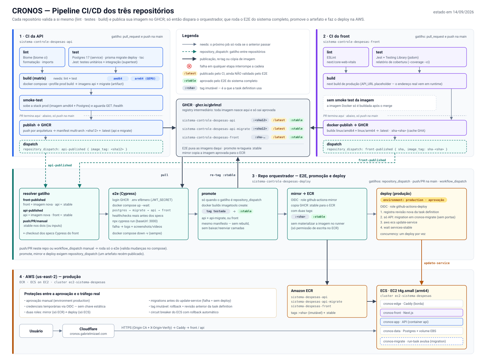
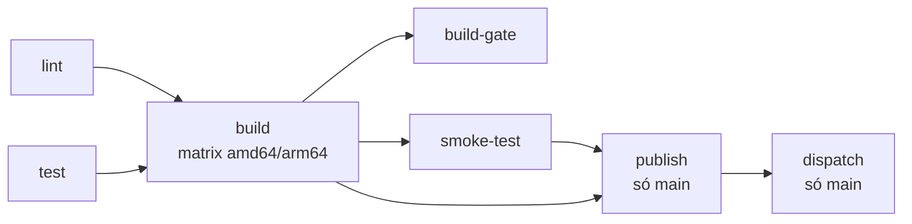
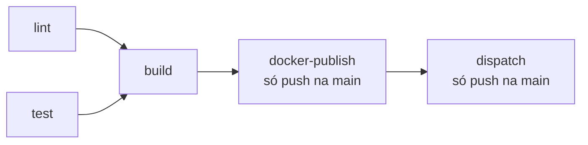
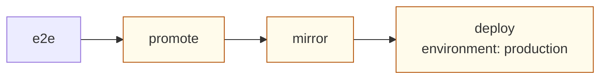
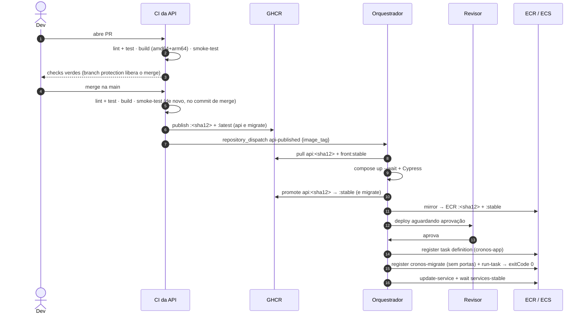

# Pipeline CI/CD — CRONOS

Como os pipelines dos três repositórios funcionam: cada um sozinho, barrando os próprios erros o mais cedo
possível, e depois juntos, a partir do gatilho que aciona este repositório orquestrador para rodar o E2E,
promover o artefato aprovado e fazer o deploy na AWS.

> **Estado em 14/09/2026.** Descreve os workflows dos três repositórios:
>
> - API: [`.github/workflows/ci.yml`](https://github.com/gbrlmzl/sistema-controle-despesas-api/blob/main/.github/workflows/ci.yml).
>   O job `lint` (Biome) entrou na `main` com o PR #17 (00h17). Com o PR #18 (10h43, `f5cf98e`), o `build`
>   passou a depender dele (`needs: [lint, test]`) e o job `test` ganhou o nome "Testes (unitário + integração)".
> - Front: [`.github/workflows/ci.yml`](https://github.com/gbrlmzl/sistema-controle-despesas-front/blob/main/.github/workflows/ci.yml)
> - Orquestrador: [`.github/workflows/ci.yml`](../.github/workflows/ci.yml). Desde `965871c` (10h27), o passo
>   "Aplicar migrations" do `deploy` roda numa família própria (`cronos-migrate`, sem `portMappings`) e falha
>   explicitamente quando o `run-task` não aloca a task.
>
> **Em andamento no fechamento desta revisão:** o merge do PR #18 dispara o primeiro `api-published` que já
> roda com a migration corrigida. O deploy dele depende de aprovação (ver [§1.4](#14-o-pipeline-em-execução)).
>
> Documentos relacionados: [`pipeline-aws.md`](./pipeline-aws.md) é o plano da Fase 8, hoje com o status de
> cada etapa. [`docker-e-arquitetura.md`](./docker-e-arquitetura.md) detalha as imagens, mas a §4.3 dele
> descreve uma versão anterior do CI.



*(Versão raster para compartilhar fora do GitHub: [`pipeline-ci-cd.png`](./pipeline-ci-cd.png).)*

---

## Sumário

1. [Visão geral](#1-visão-geral)
2. [Conceitos comuns aos três repositórios](#2-conceitos-comuns-aos-três-repositórios)
3. [Pipeline da API](#3-pipeline-da-api)
4. [Pipeline do front](#4-pipeline-do-front)
5. [A ponte: `repository_dispatch`](#5-a-ponte-repository_dispatch)
6. [Pipeline do orquestrador](#6-pipeline-do-orquestrador)
7. [Fluxo ponta a ponta](#7-fluxo-ponta-a-ponta)
8. [Mapa de detecção de erros](#8-mapa-de-detecção-de-erros)
9. [Diagnóstico, re-execução e rollback](#9-diagnóstico-re-execução-e-rollback)
10. [Pontos de atenção identificados](#10-pontos-de-atenção-identificados)

---

## 1. Visão geral

### 1.1 O princípio: *build once, promote everywhere*

Cada imagem é **buildada uma única vez**, no repositório dono do código. Daí em diante ninguém mais faz
rebuild: o orquestrador testa essa imagem, re-tagueia a mesma imagem como aprovada, copia a mesma imagem
para a AWS e sobe a mesma imagem em produção. O binário validado pelo Cypress é, bit a bit, o que roda no
ECS.

### 1.2 Os três repositórios

| Repositório | Papel no pipeline | Produz |
|---|---|---|
| `sistema-controle-despesas-api` | Valida a API isoladamente e publica a imagem | `ghcr.io/gbrlmzl/sistema-controle-despesas-api` e `…-api-migrate` |
| `sistema-controle-despesas-front` | Valida o front isoladamente e publica a imagem | `ghcr.io/gbrlmzl/sistema-controle-despesas-front` |
| `sistema-controle-despesas-deploy` | Testa a **combinação** (E2E), promove e faz o deploy | Nenhuma imagem. Só tags (`:stable`), cópias no ECR e revisões de task definition |

Os specs do Cypress ficam no repositório do front (`cypress/e2e`, junto do código que exercitam). O
orquestrador não tem código de aplicação nem de teste: tem só o `docker-compose.yml` que monta o sistema
completo e o workflow que o executa.

### 1.3 O funil em quatro camadas

O desenho é um funil. Cada camada só roda se a anterior passou, e barra uma classe de erro mais cara
que a anterior:

| Camada | Onde | Quando | Pergunta que responde |
|---|---|---|---|
| **1. Validação isolada** | CI da API / CI do front | todo PR e todo push na `main` | "Este repositório, sozinho, está correto?" |
| **2. Publicação** | CI da API / CI do front | só push na `main` | "A imagem existe no registry, com tag imutável?" |
| **3. Validação integrada** | Orquestrador, job `e2e` | a cada imagem publicada | "Esta imagem funciona junto com a última versão aprovada do outro lado?" |
| **4. Entrega** | Orquestrador, jobs `promote`, `mirror` e `deploy` | só se o E2E passou | "Aprovado, então sobe para produção, com aprovação humana" |

Um erro de tipo no TypeScript morre na camada 1, ainda no PR, sem gastar runner de E2E. Um
contrato quebrado entre front e API só aparece na camada 3, mas ainda antes de produção. O que passa das
três é exatamente o que chega na AWS.

### 1.4 O pipeline em execução

A automação até o ECS (Etapas 1, 2, 4, 5 e 6 de [`pipeline-aws.md`](./pipeline-aws.md)) está na `main` do
orquestrador desde 11/09. Estes são os runs do orquestrador desde então (horários de Brasília):

| Quando | Gatilho | Resultado |
|---|---|---|
| 11/09, 21h56–22h10 | 2 × `push` e 1 × `front-published` | `e2e` vermelho: a stack não subiu nos pushes, e um spec (`criar-residencia`) falhou no dispatch. Nada foi promovido |
| 12/09, 00h20 | [`front-published`](https://github.com/gbrlmzl/sistema-controle-despesas-deploy/actions/runs/34670092890) (front `3a64620`) | 4 tentativas. A 1ª e a 2ª falharam no OIDC do `mirror` e a 3ª no login ECR do `deploy`. A 4ª ficou verde de ponta a ponta. **Primeiro deploy automatizado** (`cronos-front`) |
| 13/09, 23h09 | [`front-published`](https://github.com/gbrlmzl/sistema-controle-despesas-deploy/actions/runs/34798259756) (front `505a98c`) | Verde de primeira, com aprovação |
| 14/09, 00h28 | [`api-published`](https://github.com/gbrlmzl/sistema-controle-despesas-deploy/actions/runs/34802740567) (API `8b9f7045fc37`, merge do Biome) | `e2e`, `promote` e `mirror` verdes. No `deploy`, a 1ª e a 2ª tentativas falharam em "Registrar revisão nova" e a 3ª (09h57, após aprovação) falhou em "Aplicar migrations". O `update-service` não rodou |
| 14/09, 10h27 | `push` (`965871c`, migration em `cronos-migrate`) | `e2e` verde. Em push o pipeline para aí |
| 14/09, 10h43 | Merge do PR #18 na API (`03adfffca316`) | CI da API em andamento. O `api-published` que ele emite é o **primeiro deploy da API com a `cronos-migrate`** |

As tentativas dos runs de 12/09 e da madrugada de 14/09 usaram o mesmo workflow (commit `50a2e47`). Por isso,
as falhas que sumiram entre uma tentativa e outra foram corrigidas **do lado da AWS** (trust policy e
permissões das roles), não no YAML.

A falha da migration é diferente e exigiu mudar o workflow. A `cronos-app` publica `hostPort: 8080`, porta
que a API antiga ainda ocupa, e o `containerOverrides` do `run-task` não consegue remover `portMappings`. A
correção é o passo com a família `cronos-migrate` (§6.5), em `965871c`.

**Até o deploy do PR #18 estabilizar:** a API em produção continua na versão anterior a `8b9f7045fc37`, mas
`api:stable` (no GHCR e no ECR) já aponta para essa tag. É o cenário do [§10, item 3](#3-stable-significa-aprovado-no-e2e-não-em-produção--médio),
e ele já aconteceu. Re-executar o run de 00h28 não resolveria (ver [§9.2](#92-re-executar-sem-novo-commit)).
Quem resolve é o dispatch novo, gerado pelo merge.

---

## 2. Conceitos comuns aos três repositórios

### 2.1 Significado das tags de imagem

| Tag | Quem cria | Quando | Significa |
|---|---|---|---|
| `:<sha12>` (API) | CI da API, job `publish` | push na `main` | Tag **imutável** do commit (12 primeiros caracteres do SHA), manifest multi-arch |
| `:<sha12>-amd64` / `-arm64` (API) | CI da API, job `publish` | push na `main` | Tags intermediárias por arquitetura, usadas só para montar o manifest |
| `:sha-<sha>` e `:sha-<sha7>` (front) | CI do front, job `docker-publish` | push na `main` | Tag **imutável** do commit, manifest multi-arch |
| `:latest` | CIs da API e do front | push na `main` | **Publicado, mas ainda NÃO validado pelo E2E.** Nunca vai para produção |
| `:stable` (GHCR) | Orquestrador, job `promote` | E2E passou | **Aprovado pelo E2E do sistema completo** (não necessariamente em produção, §10.3) |
| `:<tag imutável>` (ECR) | Orquestrador, job `mirror` | depois do `promote` | Cópia da imagem aprovada. **É esta tag que a task definition usa** |
| `:stable` (ECR) | Orquestrador, job `mirror` | depois do `promote` | Só um rótulo legível de "o que está aprovado agora" |

A task definition referencia a tag de SHA, e não `:stable`, porque assim cada deploy gera uma revisão
diferente da anterior, o histórico de revisões vira o histórico de releases e o rollback é só voltar para a
revisão anterior (ver [`pipeline-aws.md`](./pipeline-aws.md) §5.1).

### 2.2 O que roda em cada tipo de evento

| Job | PR → `main` | push na `main` | `repository_dispatch` | `workflow_dispatch` |
|---|:-:|:-:|:-:|:-:|
| **API**: `lint`, `test`, `build`, `build-gate`, `smoke-test` | ✅ | ✅ | — | — |
| **API**: `publish`, `dispatch` | — | ✅ | — | — |
| **Front**: `lint`, `test`, `build` | ✅ | ✅ | — | — |
| **Front**: `docker-publish`, `dispatch` | — | ✅ | — | — |
| **Orquestrador**: `e2e` | ✅ | ✅ | ✅ | ✅ |
| **Orquestrador**: `promote`, `mirror`, `deploy` | — | — | ✅ | — |

### 2.3 Segredos e credenciais

| Credencial | Onde fica | Tipo | Para quê |
|---|---|---|---|
| `GITHUB_TOKEN` | API e front | Automático (`packages: write`) | Push das imagens no GHCR do próprio repositório |
| `DEPLOY_DISPATCH_TOKEN` | API e front | PAT com acesso ao repo de deploy | `POST /repos/gbrlmzl/sistema-controle-despesas-deploy/dispatches` |
| `GHCR_PROMOTE_TOKEN` | Orquestrador | PAT com `write:packages` nos pacotes da API **e** do front | Pull da imagem privada da API no `e2e`, re-tag `:stable` no `promote`, leitura no `mirror` |
| `AWS_ACCOUNT_ID` | Orquestrador | Secret | Montar o ARN das roles sem expor o ID num repositório público |
| OIDC (`id-token: write`) | Orquestrador | Credencial temporária, sem chave estática | Assumir `github-actions-mirror` (só ECR) e `github-actions-deploy` (só ECS) |

Nenhum segredo de aplicação entra em imagem. O `JWT_SECRET` dos jobs de teste é gerado na hora com
`openssl rand -hex 32` e morre junto com o runner.

---

## 3. Pipeline da API

**Gatilhos:** `pull_request` e `push` na `main`. Node 24, `ubuntu-latest`.



### 3.1 `lint`: Biome

`npm ci` seguido de `npm run lint:ci` (`biome ci . --reporter=github`). O `biome ci` falha se houver
qualquer diagnóstico de formatação, organização de imports ou das regras do preset `recommended`
configuradas no `biome.json` (Biome 2.5, largura de 100 colunas, aspas simples, `noNonNullAssertion`
desligada). O `--reporter=github` transforma cada diagnóstico em anotação inline no PR.

O Biome substituiu ESLint + Prettier num único binário. O commit de adoção veio acompanhado de outro
(`de40b48`) que formatou o repositório inteiro, então o `lint` já nasceu verde. Localmente, `npm run lint`
verifica e `npm run lint:fix` aplica as correções seguras.

Com `build: needs: [lint, test]`, um lint vermelho **impede** o build, o smoke test, a publicação e o
dispatch. É o mesmo desenho do front.

### 3.2 `test`: build + testes contra Postgres real

O check aparece como **"Testes (unitário + integração)"**.

| Passo | O que faz | Erro que barra |
|---|---|---|
| Service container `postgres:17-alpine` | Sobe um Postgres real com healthcheck `pg_isready` | — |
| `npm ci` | Instalação determinística a partir do lockfile | `package.json` e `package-lock.json` fora de sincronia, pacote inexistente |
| Gerar `JWT_SECRET` efêmero | `openssl rand -hex 32` em `$GITHUB_ENV` | — |
| `npx prisma migrate deploy` | Aplica **todas** as migrations num banco vazio | SQL inválido, migration conflitante ou fora de ordem, incompatibilidade com Postgres 17 |
| `npm run build` | `prisma generate` + `tsc -p tsconfig.build.json` | Schema Prisma inválido, **erros de tipo**, imports quebrados |
| `npm test` | Jest em modo ESM: `tests/unit` (serviços, schemas zod, error handler, split…) e `tests/integration` (rotas via supertest contra o banco) | Regressão de regra de negócio, contrato HTTP, validação, autenticação/autorização, rate limit, eventos de segurança |

As variáveis do Google OAuth ficam de fora **de propósito**: o `env.ts` trata a ausência das quatro juntas
como "login com Google desabilitado". Isso também testa que a API sobe sem elas.

### 3.3 `build`: imagem de produção em duas arquiteturas

- `needs: [lint, test]`. Roda como **matrix** `linux/amd64` + `linux/arm64`.
- Gera um `.env` mínimo (`API_IMAGE`, `IMAGE_TAG=<sha12>-<arch>`) e executa
  `docker compose --profile prod build`, que builda **duas** imagens a partir do mesmo `Dockerfile`: `api`
  (estágio `runtime`) e `api-migrate` (estágio `build`).
- O leg arm64 usa QEMU. O amd64 é nativo.
- Salva as imagens com `docker save` e sobe como artifact (`docker-images-<arch>`, retenção de 1 dia) para
  os jobs seguintes. **Não há rebuild depois disto.**

**Barra:** `Dockerfile` quebrado, `COPY` de arquivo inexistente, dependência nativa (`bcrypt`, engines do
Prisma) que não instala em alguma das arquiteturas.

### 3.4 `build-gate`: check de nome fixo

Não builda nada. Só republica o resultado da matrix sob um nome estável ("Build da imagem (docker compose
--profile prod)"), porque os checks da matrix carregam a plataforma no nome e mudam sempre que a matrix
muda. Esse nome estável é o **required status check** da branch protection.

Usa `if: always()`: sem isso, um `build` com falha deixaria o gate como *skipped*, e o GitHub trata
required check *skipped* como aprovado.

Como o `build` agora depende do `lint`, um lint vermelho deixa o `build` *skipped* e o gate **vermelho**
(`needs.build.result` ≠ `success`). Na prática, o required check do build também passa a cobrar o lint.

### 3.5 `smoke-test`: a imagem sobe de verdade?

- `needs: build`. Baixa **só a imagem amd64** (nativa no runner) e dá `docker load`.
- Gera um `.env` efêmero de produção e roda `docker compose --profile prod up -d`: Postgres → `migrate`
  (`prisma migrate deploy` dentro do container) → `api`.
- Faz polling de `GET /health` (15 tentativas × 2 s). Se não responder, imprime os logs e falha.
- `docker compose down -v` sempre.

**Barra o que compila mas não roda:** variável de ambiente obrigatória rejeitada pelo `env.ts`, falta de
`openssl` para o schema-engine do Prisma, permissão de escrita em `node_modules/@prisma/engines` (container
roda como `node`), migrate falhando dentro da imagem, porta errada, `/health` quebrado.

> O `/health` não exercita o `bcrypt` do `/auth/register`. É um portão de prontidão, não de desempenho.

**Em PR, o pipeline da API termina aqui.**

### 3.6 `publish`: GHCR com manifest multi-arch *(só push na `main`)*

- `needs: [build, smoke-test]`, `if: github.ref == 'refs/heads/main'`.
- Carrega as duas arquiteturas e dá push das tags intermediárias `:<sha12>-amd64` e `:<sha12>-arm64`
  (de `api` e de `api-migrate`).
- Monta o manifest multi-arch com `docker buildx imagetools create` em `:<sha12>` e `:latest`. Isso é
  necessário porque `docker save`/`load` não preserva manifest lists.

O multi-arch existe por dois motivos. O **arm64** é o alvo de produção (Graviton `t4g.small`). O **amd64**
serve o E2E, que roda num runner amd64: sem ele, a API inteira rodaria emulada ali, o hashing de senha
ultrapassaria o timeout de 4 s do Cypress e a suíte ficaria intermitente.

### 3.7 `dispatch`: aciona o orquestrador *(só push na `main`)*

```bash
curl -fsS -X POST \
  -H "Authorization: Bearer $DEPLOY_DISPATCH_TOKEN" \
  https://api.github.com/repos/gbrlmzl/sistema-controle-despesas-deploy/dispatches \
  -d '{"event_type":"api-published","client_payload":{"image_tag":"<sha12>"}}'
```

O `-f` faz o job falhar se a API do GitHub responder com erro (token ausente ou expirado).

---

## 4. Pipeline do front

**Gatilhos:** `pull_request` e `push` na `main`. Node 24, `ubuntu-latest`.
**Concorrência:** `group: ci-${{ github.ref }}` com `cancel-in-progress: true`. Um push novo na mesma ref
cancela o run anterior.



### 4.1 `lint`: ESLint

`npm ci` seguido de `npm run lint` (`eslint .` com `eslint-config-next/core-web-vitals`). A regra
`react-hooks/set-state-in-effect` foi rebaixada para *warning* de propósito e não trava o CI.

**Barra:** violação das regras de hooks do React, más práticas do Next que afetam Core Web Vitals, erros de
sintaxe.

### 4.2 `test`: Jest

`npm run test:coverage -- --ci`: Jest com `jsdom` e Testing Library (arquivos `*.test.ts(x)` ao lado do código, em `src/`).
O `NODE_ENV=test` faz o `next/jest` carregar o `.env.test` versionado, que não tem segredo. O `--ci` impede
a gravação automática de snapshots novos.

**Barra:** regressão em formulários, validações zod, server actions, componentes e utilitários.

### 4.3 `build`: `next build` de produção

- `needs: [lint, test]`.
- `npm run build` com `API_URL=http://localhost:8080`. É um **placeholder**: o Route Handler
  `src/app/api/[...path]/route.ts`, o `apiClient.ts` e o `proxy.ts` lançam erro se `API_URL` estiver vazia,
  e o Next avalia esses módulos durante *Collecting page data*. O endereço real só importa em runtime.

**Barra:** erros de TypeScript (o `next build` faz type-check), imports quebrados, módulos que lançam
exceção ao serem avaliados, rotas mal definidas.

**Em PR, o pipeline do front termina aqui.** Diferente da API, o PR do front **não** builda a imagem
Docker nem faz smoke test (ver [§10, item 9](#9-o-front-só-valida-o-dockerfile-depois-do-merge--baixo)).

### 4.4 `docker-publish`: GHCR multi-arch *(só push na `main`)*

- `needs: build`, `if: github.event_name == 'push' && github.ref == 'refs/heads/main'`.
- QEMU + Buildx + login no GHCR com `GITHUB_TOKEN`.
- `docker/metadata-action` gera as tags `:latest`, `:sha-<sha7>` e `:sha-<sha completo>`, além dos labels
  OCI.
- `docker/build-push-action` com `platforms: linux/amd64,linux/arm64`, `build-args: API_URL=<placeholder>`
  e cache `type=gha`.
- O `Dockerfile` é multi-stage com `output: 'standalone'`, roda como `USER node`, tem `HOSTNAME=0.0.0.0` e
  `HEALTHCHECK`.

**Barra:** `Dockerfile` quebrado, `npm ci` fora de sincronia dentro da imagem, falha no leg arm64, falta de
permissão de push.

### 4.5 `dispatch`: aciona o orquestrador *(só push na `main`)*

```bash
-d '{"event_type":"front-published","client_payload":{"sha":"<sha>","image_tag":"sha-<sha>"}}'
```

É um job **separado** do `docker-publish` de propósito: se o `curl` falhar, só ele fica vermelho, e a
imagem já publicada continua contando como sucesso. O `sha` vai no payload porque o orquestrador precisa
fazer checkout dos **specs** do Cypress exatamente nesse commit.

---

## 5. A ponte: `repository_dispatch`

Os CIs de origem não sabem nada do E2E. Eles só avisam: "publiquei esta imagem". O acoplamento entre os
repositórios se resume a este contrato:

| `event_type` | Emitido por | `client_payload` | Referência no GHCR |
|---|---|---|---|
| `api-published` | CI da API, job `dispatch` | `{ image_tag: "<sha12>" }` | `…-api:<sha12>` e `…-api-migrate:<sha12>` |
| `front-published` | CI do front, job `dispatch` | `{ sha: "<sha>", image_tag: "sha-<sha>" }` | `…-front:sha-<sha>` |

Com essa separação, um E2E vermelho **não** deixa vermelho o CI da API nem o do front. O CI de origem só
responde pelo próprio código, e o orquestrador responde pela integração.

No orquestrador, os valores do `client_payload` chegam aos scripts **por `env:`**, nunca interpolados
direto no `run:`. Assim um payload malformado não pode ser interpretado como shell.

---

## 6. Pipeline do orquestrador

**Gatilhos:** `repository_dispatch` (`front-published`, `api-published`), `push` e `pull_request` na
`main` e `workflow_dispatch` manual.
**Concorrência do workflow:** `group: e2e-${{ github.ref }}` com `cancel-in-progress: true` (ver
[§10, item 2](#2-a-concorrência-do-orquestrador-cancela-deploys-da-outra-aplicação--alto)).



*(Os jobs em destaque só rodam em `repository_dispatch`.)*

### 6.1 Resolução dos parâmetros

O primeiro passo decide **o que** testar. A regra é: o artefato novo é testado contra o **último artefato
aprovado (`:stable`) do outro lado**, nunca contra algo que ninguém validou.

| Gatilho | `front_ref` (checkout dos specs) | `front_image_tag` | `api_image_tag` |
|---|---|---|---|
| `repository_dispatch: front-published` | `client_payload.sha` | `client_payload.image_tag` | `stable` |
| `repository_dispatch: api-published` | `main` | `stable` | `client_payload.image_tag` |
| `workflow_dispatch` | input (default `main`) | input (default `stable`) | input (default `stable`) |
| `push`/`pull_request` neste repo | `main` | `stable` | `stable` |

`front_ref` e `front_image_tag` são coisas diferentes: o primeiro é um ref de git e governa **só o checkout
dos specs**; o segundo é a tag que o compose sobe.

### 6.2 Job `e2e`: o sistema completo

| # | Passo | Detalhe |
|---|---|---|
| 1 | Checkout do orquestrador | Traz o `docker-compose.yml` |
| 2 | Checkout do front em `front/` | No `front_ref` resolvido. É daqui que vêm os specs do Cypress |
| 3 | `.env` efêmero | Credenciais do Postgres descartável, `JWT_SECRET` aleatório, `API_IMAGE_TAG` e `FRONT_IMAGE_TAG` |
| 4 | Login no GHCR | O pacote da API é **privado**. Sem login, o pull falha com `unauthorized` |
| 5 | Registrar QEMU | Herança de quando a imagem da API era só arm64 (ver [§10, item 11](#11-documentação-e-comentários-desatualizados--baixo)) |
| 6 | `docker compose up -d --wait` | Sobe e **espera os healthchecks**, na ordem abaixo |
| 7 | `npm ci` em `front/` + `npx cypress run --config baseUrl=http://localhost:3000` | Roda os 17 arquivos de spec de `cypress/e2e` contra a stack |
| 8 | Se falhar: `docker compose logs` + upload de `cypress/screenshots` e `cypress/videos` | Artifact `cypress-failure-evidence`, retenção de 7 dias |
| 9 | `docker compose down -v` | Sempre (`if: always()`) |

A stack é montada exatamente como em produção, só que numa rede Docker local:

```
postgres (pg_isready)
   └─▶ migrate    — imagem da API, command: npx prisma migrate deploy   (service_completed_successfully)
         └─▶ api  — NODE_ENV=production, healthcheck GET /health       (service_healthy)
               └─▶ front — NODE_ENV=production, API_URL=http://api:8080 (service_healthy)
                     ▲
                     └── Cypress, no runner, via http://localhost:3000
```

Decisões que importam:

- **A API sobe com `NODE_ENV=production`**, porque é essa a configuração que se quer validar. Nesse modo o
  `RATE_LIMIT_DISABLED` é ignorado, então os tetos foram **afrouxados, não desligados**
  (`RATE_LIMIT_GLOBAL=5000`, os demais `500`). O middleware continua sendo atravessado de verdade. Com os
  valores padrão, 11 dos 17 specs falhavam com HTTP 429, porque a suíte inteira se reparte em apenas dois
  IPs.
- **O navegador nunca fala com a API direto.** Tudo passa pelo Route Handler do front (`/api/*`), o mesmo
  caminho de produção. Por isso o E2E valida também o proxy, os cookies de sessão e o `FRONTEND_URL`.
- **Imagens publicadas, não código-fonte.** Desde que o front passou a publicar multi-arch e a resolver
  `API_URL` em runtime, o artefato testado e o promovido são o mesmo objeto nos dois lados.

### 6.3 Job `promote`: `:stable` no GHCR

- `needs: e2e`, `if: github.event_name == 'repository_dispatch'`.
- `docker buildx imagetools create --tag …:stable …:<tag testada>`
  - `api-published`: promove `sistema-controle-despesas-api` **e** `sistema-controle-despesas-api-migrate`
  - `front-published`: promove `sistema-controle-despesas-front`
- O `imagetools create` só cria uma nova referência para o manifesto que já existe no registry. Não baixa
  nem reenvia camadas, então não há como o conteúdo mudar.

Em `push`, `pull_request` ou `workflow_dispatch` não existe "um artefato recém-publicado" para promover.
Nesses casos o pipeline para no `e2e`.

### 6.4 Job `mirror`: GHCR → ECR

- `needs: promote`. Permissões `id-token: write` e `contents: read`.
- Assume a role `github-actions-mirror` via OIDC. Pelo desenho da Etapa 4 de [`pipeline-aws.md`](./pipeline-aws.md),
  ela tem permissão **só** de escrita nos repositórios ECR e a trust policy restringe o uso a jobs da `main`
  deste repositório.
- Copia `ghcr.io/…:stable` para o ECR com duas tags:
  - `sistema-despesas-api:<sha12>` e `:stable` (mais `sistema-despesas-api-migrate`)
  - `sistema-despesas-front:sha-<sha>` e `:stable`
- A cópia é feita por `imagetools create` entre registries, sem materializar a imagem no runner.
- Expõe `image_tag` como output para o `deploy`.

Empurrar imagem para o ECR não altera nada em produção. Por isso esta metade roda **antes** do portão de
aprovação e não tem nenhuma permissão de ECS.

### 6.5 Job `deploy`: ECS em produção

- `needs: mirror`, `environment: production`.
- `concurrency: { group: deploy-production, cancel-in-progress: false }`: um deploy por vez, sem cancelar
  um deploy pela metade.
- Região `us-east-2`, cluster `ec2-sistema-despesas` (EC2 `t4g.small`, arm64).

**Portão de aprovação.** Por declarar `environment: production`, o job para em *Waiting for review* até um
revisor aprovar. O environment existe desde 12/09 com *required reviewers* (`gbrlmzl`) e política de branch,
e os três runs de deploy até agora registraram aprovação. Pelo desenho da Etapa 4.2 de
[`pipeline-aws.md`](./pipeline-aws.md), a trust policy da role `github-actions-deploy` só aceita o `sub`
`repo:gbrlmzl/sistema-controle-despesas-deploy:environment:production`. Sem aprovação, a credencial AWS nem
chega a ser emitida. Essa configuração vive na AWS e em Settings → Environments, não no YAML.

| # | Passo | O que faz |
|---|---|---|
| 1 | OIDC + login ECR | Assume `github-actions-deploy`. O login só serve para obter o endereço do registry |
| 2 | **Registrar revisão nova** | Escolhe a família: `api-published` → `cronos-app` / container `api` / `sistema-despesas-api`; `front-published` → `cronos-front` / container `front` / `sistema-despesas-front`. Baixa a revisão **ativa mais recente** da família (`describe-task-definition`), troca só o campo `image` do container, remove os campos read-only com `jq` e chama `register-task-definition`. A AWS continua sendo a fonte da verdade da task definition |
| 3 | **Aplicar migrations** *(só `api-published`)* | Deriva da revisão recém-montada uma task definition da família **`cronos-migrate`**: mesmo container `api`, mesma imagem, roles e secrets, mas **sem `portMappings` e sem `healthCheck`** e com `command` `["npx","prisma","migrate","deploy"]`. Registra essa revisão e chama `aws ecs run-task`. Se o `run-task` não alocar a task, ele devolve `tasks: []` sem falhar e põe o motivo em `failures` (ex.: `RESOURCE:MEMORY`). O passo então imprime `failures` e falha. Se alocar, espera com `wait tasks-stopped` e confere o `exitCode`. Com código diferente de 0, imprime a task e falha **antes** de trocar a versão da API. É a tradução do `depends_on: service_completed_successfully` do compose |
| 4 | **Atualizar o service** | `aws ecs update-service --task-definition <revisão nova>` seguido de `aws ecs wait services-stable` |
| 5 | Se falhar | `describe-services` com os últimos 15 eventos do service no log |

**Por que a migration não roda na própria `cronos-app`.** A `cronos-app` publica `hostPort: 8080`, porta que
a API antiga continua ocupando até o `update-service`, e o `containerOverrides` do `run-task` só troca
`command` e ambiente: não remove `portMappings`. O ECS recusa a alocação (`RESOURCE:PORTS`), e foi isso que
derrubou a 3ª tentativa do deploy de 14/09. A família derivada não disputa porta nenhuma. Como ela herda o
limite rígido de 448 MiB do container `api`, ainda precisa de memória livre ao lado da API antiga (630 MB
livres medidos em 14/09). A causa de fundo, a porta fixa no host, também provoca a queda de alguns segundos
a cada deploy, e está registrada como pendência 9 do [`README.md`](../README.md).

A `cronos-migrate` usa a imagem da **API**, não a `-migrate`. A imagem `-migrate` continua sendo espelhada
no ECR, mas nada a consome ainda.

Proteção adicional do lado da AWS: segundo o [`pipeline-aws.md`](./pipeline-aws.md) §5.2, os dois services
estão com o **deployment circuit breaker** ligado e `rollback: true`. Uma revisão que não estabiliza volta
sozinha para a anterior, e o `wait services-stable` falha o job.

O deploy do **front** não roda migrations: só registra a revisão de `cronos-front` e atualiza o service.

---

## 7. Fluxo ponta a ponta

### 7.1 Exemplo: merge de um PR na API



### 7.2 Exemplo: merge de um PR no front

Mesma sequência, com estas diferenças:

1. CI do front: `lint` + `test` → `build` → (merge) → `docker-publish` → `dispatch front-published`.
2. O orquestrador faz checkout dos specs **no SHA publicado** e sobe `front:sha-<sha>` com `api:stable`.
3. `promote` e `mirror` tratam só a imagem do front.
4. `deploy` registra `cronos-front`, **sem** migrations, e atualiza o service.

Este é o caminho que já rodou verde em produção (12/09 e 13/09).

### 7.3 Ordem natural quando uma feature toca os dois lados

Como o front é testado contra `api:stable`, uma feature que depende de um endpoint novo precisa chegar
nesta ordem:

1. **API primeiro.** Merge, E2E verde e `:stable` promovido. O endpoint novo deve ser aditivo, sem quebrar o
   front atual.
2. **Front depois.** O E2E dele encontra o endpoint novo no `api:stable`.

Se o front for mergeado antes, o E2E dele falha, e essa falha é correta: é o pipeline avisando que a
dependência ainda não foi aprovada.

Atenção: `:stable` aprovado não quer dizer que o endpoint está no ar. Antes de mergear o front, confirme que o
**deploy** da API terminou (§10.3). Hoje isso não está garantido.

---

## 8. Mapa de detecção de erros

Onde cada classe de erro é barrada, da mais barata para a mais cara. A coluna "Chega em produção?" mostra o
que acontece se a etapa falhar.

### 8.1 Camada 1: validação isolada (PR e push, antes de qualquer publicação)

| Tipo de erro | Repo | Etapa que barra | Chega em produção? |
|---|---|---|---|
| Formatação, ordem de imports, regras `recommended` | API | `lint` (Biome) | Não |
| Hooks do React, más práticas do Next | Front | `lint` (ESLint) | Não |
| Lockfile dessincronizado | Ambos | `npm ci` em `lint`/`test` | Não |
| Erro de tipo TypeScript | API | `test` → `npm run build` (`tsc`) | Não |
| Erro de tipo TypeScript, módulo que quebra no build | Front | `build` (`next build`) | Não |
| Schema Prisma inválido | API | `test` → `prisma generate` | Não |
| Migration com SQL inválido ou conflitante | API | `test` → `prisma migrate deploy` (banco vazio) | Não |
| Regra de negócio / validação / autorização quebrada | API | `test` → Jest unit + integração | Não |
| Componente, formulário ou server action quebrado | Front | `test` → Jest | Não |
| `Dockerfile` quebrado | API | `build` (já no PR) | Não |
| `Dockerfile` quebrado | Front | `docker-publish` (**só depois do merge**) | Não, mas o erro só aparece na `main` |
| Imagem que compila mas não sobe (env, openssl, permissão, porta) | API | `smoke-test` (já no PR) | Não |
| Imagem que compila mas não sobe | Front | Só no `e2e` do orquestrador | Não |

### 8.2 Camada 2: publicação

| Tipo de erro | Etapa | Efeito |
|---|---|---|
| Sem permissão de push no GHCR | `publish` / `docker-publish` | Nada é publicado nem disparado |
| Falha no leg arm64 do buildx | `docker-publish` (front) | Nada é publicado |
| `DEPLOY_DISPATCH_TOKEN` ausente ou expirado | `dispatch` | Imagem publicada como `:latest`, mas o orquestrador nunca é acionado. Nada vai para produção |

### 8.3 Camada 3: validação integrada (orquestrador)

| Tipo de erro | Etapa que barra | Evidência |
|---|---|---|
| Tag inexistente ou sem permissão de pull | `compose up` | Log do step |
| Migration falha na imagem publicada | `compose up --wait` (`migrate` com exit ≠ 0) | `docker compose logs` |
| API ou front não ficam *healthy* | `compose up --wait` | `docker compose logs` |
| **Contrato front ↔ API quebrado** (payload, rota, status code) | Cypress | Screenshots/vídeos + logs |
| Sessão, cookies, refresh token, proxy `/api/*`, `FRONTEND_URL` | Cypress | Screenshots/vídeos + logs |
| Fluxo de usuário quebrado (cadastro, residência, despesas, fechamento de mês, acertos…) | Cypress | Screenshots/vídeos |
| Front caindo no error boundary ("Não foi possível carregar esta página") | Cypress | Screenshot |

Qualquer falha aqui interrompe o `promote`: **nada vira `:stable`, nada vai para o ECR, nada vai para
produção.**

### 8.4 Camada 4: entrega (AWS)

| Tipo de erro | Etapa que barra | Efeito em produção |
|---|---|---|
| `GHCR_PROMOTE_TOKEN` sem `write:packages` | `promote` | Nenhum |
| Provedor OIDC / trust policy da role de mirror, repositório ECR inexistente | `mirror` → `configure-aws-credentials` ou cópia | Nenhum (aconteceu em 12/09, 1ª e 2ª tentativas) |
| Role de deploy sem permissão de login no ECR | `deploy` → `amazon-ecr-login` | Nenhum (aconteceu em 12/09, 3ª tentativa) |
| Deploy rejeitado pelo revisor | `deploy` (aprovação) | Nenhum (mas veja §10.3) |
| JSON de task definition inválido, permissão de ECS ou `iam:PassRole` | `deploy` → registrar revisão | Nenhum (aconteceu em 14/09, 1ª e 2ª tentativas) |
| Task de migration não alocada (`RESOURCE:PORTS`, `RESOURCE:MEMORY`) | `deploy` → `run-task` devolve `failures` | A API antiga continua no ar. `RESOURCE:PORTS` foi a falha de 14/09 e deixa de ocorrer com a `cronos-migrate` |
| **Migration falha com os dados reais** (constraint, NOT NULL em tabela populada…) | `deploy` → `exitCode` ≠ 0 | A API antiga continua no ar. A migration fica registrada como falha em `_prisma_migrations` e precisa de intervenção |
| Container novo não estabiliza (crash, healthcheck) | `deploy` → `wait services-stable` + circuit breaker | Rollback automático para a revisão anterior |

---

## 9. Diagnóstico, re-execução e rollback

### 9.1 Onde olhar quando algo falha

| Falhou em… | Onde está a informação |
|---|---|
| `lint` da API | Anotações inline no PR (`--reporter=github`) |
| `test` (API/front) | Log do job; saída do Jest |
| `smoke-test` (API) | Step "Subir a stack…" imprime `docker compose logs` |
| `e2e` | Step "Logs da stack" + artifact **`cypress-failure-evidence`** (screenshots e vídeos, 7 dias) |
| `deploy` | Step "Eventos do service" (últimos 15 eventos do ECS). Na migration, o `failures` do `run-task` (task não alocada) ou o `describe-tasks` impresso (exit ≠ 0) |

### 9.2 Re-executar sem novo commit

- **Dispatch falhou na origem** (token): corrigir o secret e usar *Re-run failed jobs* no run do CI da API
  ou do front. Só o `dispatch` roda de novo.
- **Falha de configuração na AWS ou E2E instável:** *Re-run failed jobs* no run original. O re-run preserva o
  evento `repository_dispatch` e o `client_payload`, então `promote`, `mirror` e `deploy` continuam
  elegíveis. Foi assim que o deploy do front de 12/09 ficou verde na 4ª tentativa, depois dos ajustes de IAM.
- **O re-run usa o workflow do run original.** Ele roda com o mesmo `GITHUB_SHA`, e portanto com o `ci.yml`
  daquele commit. Uma correção **no YAML** do orquestrador, como a da `cronos-migrate`, não vale para runs
  antigos. Para aplicar a correção a uma imagem já publicada, dispare de novo o evento com a mesma tag (o
  `promote` e o `mirror` só re-apontam as mesmas tags):

  ```bash
  curl -fsS -X POST -H "Authorization: Bearer <PAT com acesso ao repo de deploy>" -H "Accept: application/vnd.github+json" https://api.github.com/repos/gbrlmzl/sistema-controle-despesas-deploy/dispatches -d '{"event_type":"api-published","client_payload":{"image_tag":"<sha12>"}}'
  ```

  Um merge novo na API tem o mesmo efeito, com uma imagem nova. Foi assim em 14/09: o deploy de
  `8b9f7045fc37` falhou com o workflow antigo, e o merge do PR #18 gerou o dispatch que já usa o corrigido.
- **`workflow_dispatch` manual serve só para reproduzir um cenário.** Ele roda apenas o `e2e`, **não**
  promove nem faz deploy.

### 9.3 Rollback

A task definition usa tags imutáveis, então voltar é apontar o service para uma revisão anterior. Antes,
confira qual revisão **está em uso**, porque a mais recente da família pode nunca ter entrado no ar. É o caso
de `cronos-app` depois de 14/09: o deploy registrou a revisão nova e falhou antes do `update-service`.

```bash
aws ecs describe-services --region us-east-2 --cluster ec2-sistema-despesas --services cronos-app --query "services[0].deployments[].{Status:status,TaskDef:taskDefinition}" --output table
```

```bash
aws ecs update-service --region us-east-2 --cluster ec2-sistema-despesas --service cronos-app --task-definition cronos-app:<revisao anterior>
```

Para o front, troque `cronos-app` por `cronos-front`. Migrations **não** são revertidas por esse comando.
Por isso elas precisam ser retrocompatíveis (§10.6).

---

## 10. Pontos de atenção identificados

Achados da leitura dos três workflows e dos runs de 11 a 14/09, ordenados por impacto.

### 1. O deploy da API está pendente e `api:stable` está à frente de produção · **alto (agora)**

Desde a madrugada de 14/09, `api:stable` e `sistema-despesas-api:stable` apontam para `8b9f7045fc37`, mas o
`cronos-app` continua na revisão anterior (§1.4). Enquanto isso durar:

- todo E2E disparado pelo front valida contra uma API que **não** está no ar;
- a revisão mais recente de `cronos-app` não é a que está rodando (§9.3).

**Ação:** acompanhar o `api-published` gerado pelo merge do PR #18 (`03adfffca316`). Ele já roda com
`965871c` e é o primeiro teste real da `cronos-migrate`. Aprovado e com `services-stable`, `:stable` volta a
coincidir com produção e este item fecha. Se ele falhar antes do `update-service`, o item continua aberto.
Um *Re-run* do run de 00h28 não serve, porque usaria o workflow antigo.

### 2. A concorrência do orquestrador cancela deploys da outra aplicação · **alto**

```yaml
concurrency:
  group: e2e-${{ github.ref }}
  cancel-in-progress: true
```

Em `repository_dispatch`, `github.ref` é sempre a branch padrão. Por isso **todo** dispatch, da API ou do
front, cai no mesmo grupo `e2e-refs/heads/main`. Consequência: um merge no front enquanto o run da API
ainda está no `e2e`, ou **parado esperando aprovação do `deploy`**, cancela o run da API inteiro. A
imagem da API fica em `:latest`, nunca é promovida e nunca vai para produção, sem nenhum alerta além de um
run "cancelled". O `concurrency` do job `deploy` não protege contra isso, porque o cancelamento acontece no
nível do workflow.

A janela é real: no run de 14/09, o `deploy` da API ficou mais de 9 horas esperando aprovação (das 00h33 às
09h57). Um merge no front nesse intervalo teria cancelado o run.

**Sugestão:** isolar o grupo por artefato nos dispatches e manter o comportamento atual para push/PR,
deixando a serialização só no `deploy-production`:

```yaml
concurrency:
  group: e2e-${{ github.event_name == 'repository_dispatch' && format('{0}-{1}', github.event.action, github.event.client_payload.image_tag) || github.ref }}
  cancel-in-progress: true
```

Fazer junto com o item 10.

### 3. `:stable` significa "aprovado no E2E", não "em produção" · **médio**

`promote` e `mirror` rodam **antes** da aprovação. Se um deploy for rejeitado, ficar pendente ou falhar, o
`:stable` passa a apontar para uma versão que não está no ar. O próximo E2E do outro lado valida contra essa
versão, e não contra a de produção. Exemplo: `api:stable` = v2 não deployada, prod = v1, o front passa no
E2E contra a v2 e sobe falando com a v1.

**Não é mais hipotético:** é exatamente o estado descrito no item 1.

**Sugestão:** criar uma tag `:production` (no GHCR e/ou ECR) aplicada só depois do `services-stable`, ou,
como regra operacional, reverter o `:stable` quando um deploy for rejeitado ou falhar.

### 4. No `api-published`, os specs vêm da `main` do front, mas a imagem vem do `:stable` · **médio**

`front_ref=main` com `front_image_tag=stable`. Se a `main` do front tiver commits ainda não promovidos (E2E
do front vermelho, em andamento ou cancelado), os specs podem testar telas que a imagem `:stable` ainda não
tem. O E2E da API falha por um motivo que não tem nada a ver com a API.

**Sugestão:** fazer checkout dos specs no commit da imagem `:stable` do front. O `docker/metadata-action`
já grava esse SHA no label `org.opencontainers.image.revision`, que dá para ler com
`docker buildx imagetools inspect`.

### 5. A variante arm64 só é executada pela primeira vez em produção · **médio**

O `smoke-test` da API usa a imagem amd64, e o runner amd64 do E2E também puxa a variante amd64 do manifest.
A variante **arm64**, a única que vai para o Graviton, é buildada mas nunca executada antes do ECS. Um
problema específico da arquitetura (binário nativo do `bcrypt`, engines do Prisma) só aparece no `deploy`,
onde o circuit breaker faz o rollback. No caso da API, a migration roda antes, e também em arm64.

**Sugestão:** um smoke test do leg arm64 num runner arm64 hospedado pelo GitHub (ex.:
`ubuntu-24.04-arm`; confirmar a disponibilidade para o plano/visibilidade do repositório), ao menos antes
do `publish`.

### 6. Migrations rodam com a API antiga no ar e só são testadas em banco vazio · **médio (processo)**

- No `deploy`, a migration roda **antes** do `update-service`, com a revisão antiga da API atendendo
  tráfego. Toda migration precisa ser **retrocompatível** (padrão *expand/contract*: adicionar, migrar,
  só depois remover).
- No CI e no E2E, `prisma migrate deploy` roda em banco **vazio**. Falhas que dependem de dados (NOT NULL
  numa tabela populada, UNIQUE com duplicatas) só aparecem no passo de migration de produção.
- A task `cronos-migrate` herda os 448 MiB rígidos da API e disputa memória com a API antiga. Se a folga
  cair, o passo falha com `RESOURCE:MEMORY`, e a saída passa a ser reduzir o `memory` da família derivada
  no `jq`.
- Cada deploy da API registra **duas** revisões (`cronos-app` e `cronos-migrate`). É inofensivo, mas o
  histórico cresce; desregistrar revisões antigas de `cronos-migrate` de vez em quando basta.

### 7. Os nomes dos checks da API mudaram · **baixo (verificar)**

- O job `test` passou a se chamar **"Testes (unitário + integração)"**. Se o check `test` estiver
  configurado como *required* na branch protection, o próximo PR fica preso em *Expected — Waiting for
  status to be reported*. Troque pelo nome novo no mesmo momento do merge.
- O check **"Lint"** só impede o merge se estiver na lista de required checks. Com o `build` dependendo dele,
  o `build-gate` já fica vermelho quando o lint falha, mas incluir "Lint" explicitamente deixa o motivo
  visível no PR.

### 8. Uma migration que falha deixa uma revisão órfã de `cronos-migrate` e de `cronos-app` · **informativo**

O `deploy` registra as duas revisões antes de saber se a migration passa. Quando ela falha, as revisões
ficam registradas e nunca entram no ar. Não quebra nada, porque o próximo deploy parte da revisão ativa mais
recente e só troca a imagem, mas é mais um motivo para conferir a revisão em uso antes de um rollback (§9.3).

### 9. O front só valida o `Dockerfile` depois do merge · **baixo**

No PR, o front roda `lint`, `test` e `next build`, mas não builda a imagem. Um erro no `Dockerfile` (ex.:
`.next/static` não copiado, `HOSTNAME`) só aparece no `docker-publish` da `main` ou no `e2e`, depois que o
código já está mergeado.

**Sugestão:** no PR, um `build-push-action` com `push: false`, só `linux/amd64` e cache GHA, seguido de um
`curl` de fumaça, espelhando o `smoke-test` da API.

### 10. O `mirror` copia de `:stable`, não da tag testada · **baixo**

Hoje o `:stable` acabou de ser apontado para a tag testada, então o conteúdo é o mesmo. Mas, se o item 2
for corrigido e dois runs do mesmo artefato passarem a coexistir, `…:stable` pode já ser de outro run.

**Sugestão:** copiar de `ghcr.io/gbrlmzl/$repo:$TAG` em vez de `:stable`.

### 11. Documentação e comentários desatualizados · **baixo**

- Step "Registrar QEMU" do `e2e`: o comentário diz que a imagem da API "é linux/arm64 puro", o que deixou de
  ser verdade com o manifest multi-arch. O step virou desnecessário (inofensivo, custa alguns segundos).
- [`docker-e-arquitetura.md`](./docker-e-arquitetura.md) §4.3 e §6: descrevem imagens `linux/arm64` puras,
  `FRONT_CONTEXT` e `api_image_tag=latest`.
- [`borda-cloudflare.md`](./borda-cloudflare.md) ainda diz "planejado, não executado", mas produção já responde
  por `cronos.gabrielmizael.com` via Cloudflare.
- `docker-compose.yml` e `.env.example` deste repositório usam `API_IMAGE_TAG=latest` como default para rodar
  localmente, enquanto o CI usa `stable` dos dois lados.

### 12. `cancel-in-progress` no CI do front pode pular um dispatch · **informativo**

Dois merges seguidos na `main` do front cancelam o primeiro run, às vezes entre o `docker-publish` e o
`dispatch`. Não é um bug: o segundo commit contém o primeiro e será testado. Mas explica por que existem
imagens `sha-*` no GHCR que nunca passaram pelo E2E.

### Resolvidos desde a versão de 13/09

- ~~**O `lint` da API não bloqueava `publish` nem `dispatch`.**~~ O Biome foi mergeado (PR #17) e o `build`
  passou a declarar `needs: [lint, test]` (PR #18).
- ~~**O portão de aprovação dependia de configuração não verificada.**~~ O environment `production` tem
  *required reviewers* e política de branch, e os runs de 12, 13 e 14/09 pararam para aprovação. Observação:
  `can_admins_bypass` está ligado, então um admin do repositório consegue pular a revisão.
- ~~**A migration de produção disputava a porta 8080 com a API antiga.**~~ O passo passou a usar a família
  `cronos-migrate`, sem `portMappings` (`965871c`). A validação em produção é o deploy do item 1.
- ~~**README do orquestrador desatualizado.**~~ Seções de arquitetura, CI e pendências reescritas em 14/09.
